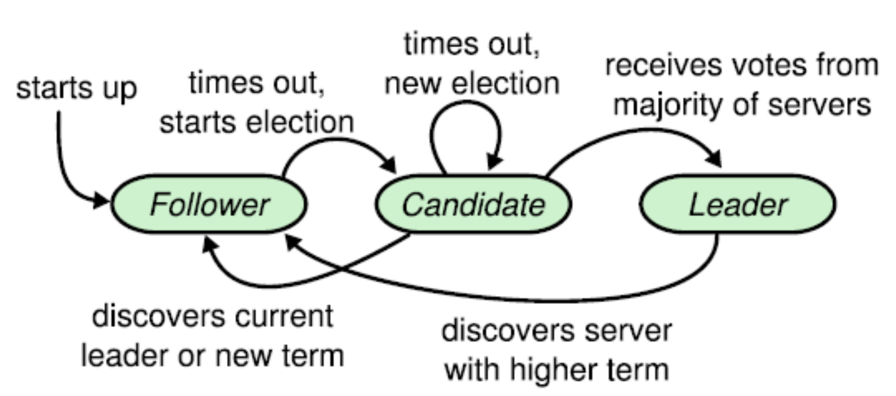

# Raft

This is a implementation of a RAFT distributed consensus algorithm.

Raft is a consensus algorithm that is designed to be easy to understand. It’s equivalent to Paxos in fault-tolerance and performance. The difference is that it’s decomposed into relatively independent subproblems, and it cleanly addresses all major pieces needed for practical systems. We hope Raft will make consensus available to a wider audience, and that this wider audience will be able to develop a variety of higher quality consensus-based systems than are available today.

<p align="center">
  
</p>

## What does it contain?
It consists of three directories
- Raft
  - messages
  - servers
  - states
  
- UnitTests
  - test_CandidateServer.py
  - test_LeaderServer.py
  - test_FollowerServer.py
  
- BehavioralTests
  - LeaderElection.py
    - During a leader election, the RequestVote RPC also contains information about the candidate’s log(like term number) to figure out which one is the latest. If the candidate requesting the vote has less updated data than the Follower from which it is requesting vote, the Follower simply doesn’t vote for the said candidate. The following excerpt from the original Raft paper clears it in a similar and profound way.
  - LogReplication.py
    - Each request made by the client is stored in the Logs of the Leader. This log is then replicated to other nodes(Followers).
    - A log entry contains: 
      - Command specified by the client to execute
      - Index to identify the position of entry in the log of the node.
      - Term Number to ascertain the time of entry of the command.

## How to Test

Make sure you are in the raftConsensus directory

#### How to unit Test
**For Testing the Follower, Candidate and Leader**
```
   python -m UnitTests.test_FollowerServer.py
   python -m UnitTests.test_CandidateServer.py
   python -m UnitTests.test_LeaderServer.pys
```
#### How to behavioral Test
For testing leader election and log replication
```
  python -m BehavioralTests.leader_election
  python -m BehavioralTests.log_replication
```
## Dependencies

This implementation is completed in Python.

- nose==1.3.0 
  - nose extends the test loading and running features of unittest, making it easier to write, find and run tests.
- pyzmq==14.3.1 
  - This package contains Python bindings for ØMQ. ØMQ is a lightweight and fast messaging implementation.
- wsgiref==0.1.2 
  - A reference implementation of the WSGI specification that can be used to add WSGI support to a web server or framework.


References:
==========
* [In Search of an Understandable Consensus Algorithm](https://ramcloud.stanford.edu/wiki/download/attachments/11370504/raft.pdf)
* [Raft Lecture](http://www.youtube.com/watch?v=YbZ3zDzDnrw)
* [Safty and Liveness](https://container-solutions.com/raft-explained-part-33-safety-liveness-guarantees-conclusion/)
* [Raft Simulation Cartoon](https://www.youtube.com/watch?v=xieqo3Tb5LQ)
* [Raft Consensus Algorithm](https://medium.com/@amangoeliitb/raft-consensus-algorithm-d93e7ee22b12)
* [Paxos and Raft](https://blockonomi.com/paxos-raft-consensus-protocols/)
* [Paxos & Raft Video](https://www.youtube.com/watch?v=Hm5LAxKxrD8)
* [Leader Election and Log Replication](https://www.youtube.com/watch?v=Bxm4FG4Nvs0)

